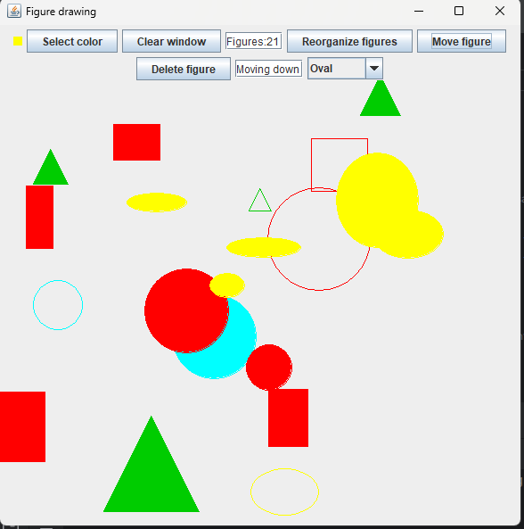

# Dibujo de figuras
Con este código podrás dibujar figuras en la pantalla, selecciona donde lo quieres pintar y dale click, con el izquierdo sera un cuadrado con relleno, con el derecho no lo tendrá,
su tamaño sera aleatorio

## Elige la figura que deseas

Usa el selector para elegir la figura que deseas dibujar, puedes elegir entre:
- Cuadrado
- Circulo
- Triangulo
- Ovalo
- Rectangulo

## Selecciona el color
Puedes seleccionar cualquier color utilizando el botón select color

## ¿Y si me equivoco?
Puedes borrar las figuras apretando el boton de delete figure y seleccionado aquellos que quieras eliminar, vuelvelo a oprimir para desactivar el borrado de figuras

## Reoroganiza los cuadros
Puedes reorganizar las figuras aleatoriamente pulsando un botón

## Mover un solo cuadro
Con este botón podras mover una figura a tu dispocición, aquí como hacerlo:
1. Presiona el boton: Al hacerlo se activara la función y deshabilitara la función de crear y borrar figuras.
2. Selecciona la figura: Haz click en la figura que quieras mover, al lado del botón aparecerá "figura selected" si la operación tuvo exito.
3. Usa las flechas del teclado para moverlo
4. Presiona nuevamente el boton al terminar: Así restableceras las funciones de crear y borrar.

## Cambia el estilo
Usando el boton de invert fill color, para añadir relleno a las figuras sin relleno y quitarlo a las figuras con relleno

## Atajos
Usa taclas para tener algunos atajos
- N: para conocer el número de figuras
